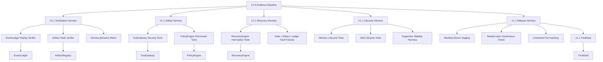

# OGK-Final V1.1 Hardening Design Draft

Status: Draft v0 for review
Date: 2026-07-09
Source baseline: OGK-Final V1.0, `FINAL_SUCCESS`, `COMPLETED`, `RELEASE_ACCEPTED`

## 1. Purpose

V1.1 is a hardening release. Its purpose is not to re-prove or rewrite V1.0, but to make the V1.0 governance kernel easier to independently verify, replay, audit, stress, and release without manual sealing mistakes.

The design follows the V1.0 boundary:

- Do not modify `ogk-final-v1.0`.
- Do not rewrite V1.0 release history.
- Do not backfill V1.1 test results into V1.0 acceptance.
- Do not import or copy Hermes runtime.
- Do not bypass `PolicyEngine`, `ToolGateway`, `EventLedger`, `ArtifactRegistry`, or `FinalSeal`.
- Do not use blind `git add .` for release staging.
- Do not force the nested `main/` repository into the top-level release.

## 2. Requirements

### 2.1 Functional Requirements

V1.1 must deliver these capabilities:

1. Independent EventLedger replay verification.
2. Independent ArtifactRegistry hash verification.
3. Executable Hermes behavior-equivalence test matrix.
4. ToolGateway security test suite.
5. PolicyEngine permission-blocking test suite.
6. RecoveryEngine interruption and repair-boundary test suite.
7. Memory and Skill lifecycle execution tests.
8. Supervisor long-running stability test harness.
9. `main/` nested repository governance decision and safety checks.
10. Untracked file classification inventory.
11. Manifest-driven release staging and release-critical file checks.
12. V1.1 final-seal flow derived from evidence, not hand-written status.

### 2.2 Non-Functional Requirements

- Verifiability: a reviewer can reproduce replay/hash/security conclusions from committed inputs.
- Auditability: every hardening result has an event, report, and artifact registry entry.
- Safety: destructive, external, secret, core-runtime, migration, and final-seal operations default to deny or approval.
- Repeatability: verification scripts must be deterministic against a fixed release tree.
- Maintainability: new tests should be small, explicit, and tied to existing OGK module boundaries.
- Release hygiene: release packaging must be manifest-driven and fail closed when critical files are missing.

## 3. Design Alternatives

### Option A: Hardening Layer Over Existing Modular Kernel

Add focused verification, safety, recovery, lifecycle, and release-automation modules around the existing OGK-Final modules.

Recommendation: choose this option.

Why: V1.0 is accepted and already structured around EventLedger, ArtifactRegistry, StateMachine, QualityGate, PolicyEngine, ToolGateway, RecoveryEngine, and FinalSeal. V1.1 should strengthen these contracts without introducing a new runtime or distributed architecture.

Trade-offs:

- Positive: lowest risk to V1.0 boundary, easiest to audit, smallest operational burden.
- Negative: it improves confidence and tooling more than it adds visible user-facing features.

### Option B: New V1.1 Runtime Orchestrator

Create a separate orchestrator that wraps all governance execution and owns replay, release, recovery, and test scheduling.

Trade-offs:

- Positive: clean place to centralize workflows.
- Negative: high risk of duplicating Supervisor/StateMachine responsibilities and blurring the "OpenClaw native runtime is not replaced" rule.

Decision: reject for V1.1. Consider only after hardening exposes a real orchestration gap.

### Option C: Test-Only Release

Only add tests and reports, with no new governance tools or release automation.

Trade-offs:

- Positive: very low implementation risk.
- Negative: leaves the known Git sealing and manifest hygiene risks unresolved.

Decision: reject as too narrow. V1.1 must harden both verification and release process.

## 4. High-Level Architecture

V1.1 remains a modular monolith hardening layer inside the OpenClaw native governance kernel. The architecture stays event-ledger-first: event logs are the highest fact source, while state files and reports remain derived snapshots.

## 5. Component Design

### 5.1 Independent EventLedger Replay Verifier

Purpose: prove that the ledger can rebuild the accepted V1.0 state without trusting final state snapshots.

Inputs:

- `reports/events/openclaw-governance-events.jsonl`
- State transition rules from the governance state machine
- Expected terminal status: `FINAL_SUCCESS`, `COMPLETED`, `RELEASE_ACCEPTED`

Outputs:

- `reports/v1_1/verification/eventledger_replay_result.json`
- `reports/v1_1/verification/eventledger_replay_report.md`

Acceptance:

- Rebuilds PHASE_01 through PHASE_07 as `ACCEPTED`.
- Rebuilds final release state as `RELEASE_ACCEPTED`.
- Detects missing, reordered, malformed, or hash-chain-invalid events.
- Does not rely on `current_state.json` except as an expected comparison target.

### 5.2 Independent ArtifactRegistry Hash Verifier

Purpose: prove artifact integrity from registry/index/tag inputs while clearly separating authoritative hashes from human-readable reports and self-referential hash notes.

Inputs:

- Artifact registry JSON
- Release artifact index
- Git tag tree for the V1.0 baseline
- Post-seal hash note, when available

Outputs:

- `reports/v1_1/verification/artifact_hash_result.json`
- `reports/v1_1/verification/artifact_hash_report.md`

Acceptance:

- Validates registry-listed artifacts.
- Flags missing files, hash mismatches, and out-of-scope files.
- Classifies self-referential or post-refresh report differences as explained/non-authoritative when evidence supports that classification.
- Fails closed on release-critical missing artifacts.

### 5.3 Hermes Behavior Equivalence Matrix

Purpose: turn existing Hermes behavior-equivalence audit conclusions into executable tests.

Behavior categories:

- Equivalent: OpenClaw behavior matches Hermes intent.
- Safer: OpenClaw intentionally adds stricter governance.
- Enhanced: OpenClaw exceeds Hermes capability while preserving intent.
- Partial: capability exists but is intentionally incomplete or bounded.
- Not copied: Hermes implementation detail intentionally excluded.

Outputs:

- `tests/v1_1/test_hermes_behavior_equivalence.py`
- `reports/v1_1/hermes_behavior_matrix.json`
- `reports/v1_1/hermes_behavior_equivalence_report.md`

Acceptance:

- Each of the 14 Hermes capability groups has at least one executable assertion or an explicit `not-copied` rationale.
- Partial items must name what is missing and why it is acceptable.
- The test matrix must not require Hermes runtime execution.

### 5.4 ToolGateway Security Test Suite

Purpose: verify that all risky tool operations are mediated and denied or routed to approval as required.

Test classes:

- Safe write
- Dangerous write
- External side effect
- Secret access
- Core runtime mutation
- Final-seal mutation

Acceptance:

- Safe operations pass through documented paths.
- Dangerous operations are blocked or require explicit approval.
- Secret and core-runtime mutation attempts fail closed.
- All denied operations emit auditable events.

### 5.5 PolicyEngine Permission Test Suite

Purpose: verify default-deny behavior and auditable exception paths.

Permission classes:

- Destructive
- External
- Secret
- Core runtime
- Migration
- Release
- Final seal

Acceptance:

- Default policy denies high-risk actions.
- Approved exceptions are explicit, scoped, and logged.
- Policy decisions can be explained from policy input, not inferred from tool side effects.

### 5.6 RecoveryEngine Interruption Tests

Purpose: prove interruption diagnosis and repair boundaries without overclaiming self-healing.

Fault fixtures:

- Task interruption
- Missing derived state
- Missing artifact
- Ledger inconsistency
- Policy denial during recovery
- Partial final-seal evidence

Recovery levels:

- R0: no-op diagnosis
- R1: rebuild derived snapshot from ledger
- R2: regenerate report from valid evidence
- R3: require human approval
- R4: cannot repair safely
- R5: release-blocking inconsistency

Acceptance:

- R0-R2 repairs are deterministic and evidence-preserving.
- R3+ never mutates release-critical artifacts without approval.
- Recovery results are recorded in EventLedger and IssueRegister.

### 5.7 Memory and Skill Lifecycle Tests

Purpose: prove that memory/skill governance rules are executable, not only documented.

Lifecycle fields:

- Source
- Purpose
- Scope
- Expiry
- Audit trail
- Promotion path
- Rollback path

Acceptance:

- Memory entries without source/purpose are rejected or quarantined.
- Skill promotion requires audit evidence.
- Rollback restores prior approved state and records evidence.
- Expired or out-of-scope items cannot silently influence governance decisions.

### 5.8 Supervisor Stability Harness

Purpose: exercise long-running governance progress without creating a new runtime.

Acceptance:

- Runs deterministic long-duration task simulations.
- Records heartbeat/progress events.
- Detects stuck states, repeated failures, and invalid phase transitions.
- Produces a stability summary without requiring external services.

### 5.9 Nested `main/` Repository Governance

Purpose: formalize the V1.0 decision that `main/` is excluded and define future handling.

Options to evaluate:

1. Continue excluding `main/`.
2. Convert `main/` into a submodule.
3. Move `main/` outside the release workspace.
4. Archive `main/` as an independent artifact.
5. Treat `main/` as a separate release line.

Recommended default for V1.1: continue excluding `main/` while producing a governance report and safety check that prevents accidental staging.

Acceptance:

- `main/` is never added by manifest-driven staging unless a later ADR accepts a different treatment.
- The governance report records current state, risk, and recommended future path.

### 5.10 Untracked File Classification

Purpose: classify historical reports, caches, temporary files, and potentially valuable artifacts before any cleanup.

Categories:

- Keep in V1.1 release
- Archive outside release
- Ignore/cache
- Temporary/delete candidate
- Needs human review
- Nested repository boundary

Acceptance:

- Produces a classification manifest before cleanup.
- Does not delete files as part of classification.
- Release-critical candidates must be reviewed before inclusion.

### 5.11 Manifest-Driven Release Harness

Purpose: prevent another release where critical files are accidentally omitted.

Inputs:

- `release_manifest.v1_1.json`
- Required file patterns
- Forbidden file patterns
- Generated verification reports

Acceptance:

- Stages only files listed in the manifest or generated by approved release steps.
- Fails if required files are missing.
- Fails if forbidden paths, including excluded nested repositories, are selected.
- Produces a release staging report.

## 6. Proposed Phase Plan

### Phase 01: Independent Verification and Safety Tests

Scope:

- EventLedger replay verifier
- ArtifactRegistry hash verifier
- ToolGateway security tests
- PolicyEngine permission tests

Exit criteria:

- All four suites run locally and generate reports.
- Critical verification failures enter IssueRegister.
- No V1.0 files, tags, or release reports are modified.

### Phase 02: Recovery and Behavior Matrix

Scope:

- RecoveryEngine interruption tests
- Hermes behavior equivalence matrix
- Memory/Skill lifecycle tests

Exit criteria:

- R0-R5 recovery behavior is documented by executable fixtures.
- Hermes behavior matrix covers all 14 capability groups.
- Memory/Skill lifecycle rules are proven executable.

### Phase 03: Operational Hardening

Scope:

- Supervisor stability harness
- Dashboard/export report enhancement
- Untracked file classification
- `main/` governance report

Exit criteria:

- Long-running simulations pass or produce actionable issues.
- File classification is complete before cleanup.
- `main/` handling has an ADR.

### Phase 04: Release Automation and Final Seal

Scope:

- Manifest-driven staging
- Release-critical file checks
- V1.1 artifact registry updates
- V1.1 final acceptance, audit, and final seal

Exit criteria:

- No blind `git add .`.
- V1.1 final status is derived from evidence.
- Release tag is distinct from V1.0 and includes all required files.

## 7. Key Architecture Decisions

### ADR-001: Use a Hardening Layer, Not a New Runtime

Status: Proposed

Context: V1.0 accepted OpenClaw native runtime as the execution base and explicitly avoided copying Hermes runtime. V1.1 needs stronger verification and release safety.

Decision: Build V1.1 as a hardening layer around existing OGK modules.

Consequences:

- Positive: preserves V1.0 boundaries and reduces operational risk.
- Positive: keeps evidence, replay, policy, and seal semantics consistent.
- Negative: does not introduce a broad new orchestration runtime.

Alternatives considered:

- New orchestrator: rejected due to runtime-boundary risk.
- Test-only release: rejected because release automation risks would remain.

### ADR-002: EventLedger Remains the Highest Fact Source

Status: Proposed

Context: V1.0 audit states that state files are derived snapshots, not authority.

Decision: V1.1 replay verification must rebuild state from EventLedger and compare snapshots only as expected outputs.

Consequences:

- Positive: strengthens independent reproducibility.
- Negative: requires explicit handling of event schema/version compatibility.

### ADR-003: Release Staging Is Manifest-Driven

Status: Proposed

Context: V1.0 needed a patch because release-critical files were omitted from the first release commit.

Decision: V1.1 release staging uses a manifest and fails closed when required files are missing or forbidden files are selected.

Consequences:

- Positive: avoids accidental omissions and nested repo inclusion.
- Negative: manifest maintenance becomes a release requirement.

### ADR-004: `main/` Stays Excluded Until a Dedicated ADR Changes It

Status: Proposed

Context: V1.0 excludes nested `main/` from release scope due to Git boundary risk.

Decision: V1.1 keeps `main/` excluded and adds governance checks/reporting.

Consequences:

- Positive: preserves top-level release clarity.
- Negative: `main/` remains a separate unresolved governance topic until explicitly decided.

## 8. Data and Evidence Flow

1. V1.1 tests read V1.0 baseline artifacts as immutable inputs.
2. Verification harnesses produce JSON results and human-readable reports.
3. Results are registered in ArtifactRegistry.
4. Significant pass/fail events are appended to EventLedger.
5. QualityGate evaluates reports and IssueRegister status.
6. FinalSeal derives V1.1 completion from evidence.
7. Release harness stages only manifest-approved files.

## 9. Failure Modes and Mitigations

| Failure | Impact | Mitigation |
|---|---|---|
| Replay result diverges from V1.0 state | Blocks V1.1 verification | Classify as ledger, state, schema, or expected-output issue |
| Hash mismatch | Blocks artifact verification | Separate authoritative registry mismatch from self-referential report differences |
| Security test triggers risky operation | Could mutate environment | Use dry-run fixtures and denied-by-default policies |
| Recovery test over-repairs | Overclaims self-healing | Enforce R0-R5 boundaries and require approval at R3+ |
| `main/` accidentally staged | Release boundary confusion | Manifest forbidden-path check |
| Untracked cleanup deletes useful evidence | Evidence loss | Classify first, delete later only after review |
| Release manifest omits critical file | Incomplete tag | Required-file checks fail release |

## 10. Acceptance Criteria

V1.1 can be accepted only when:

1. EventLedger replay verification passes.
2. ArtifactRegistry hash verification passes or produces accepted, evidence-backed exceptions.
3. Hermes behavior matrix covers all 14 capability groups.
4. ToolGateway security tests pass.
5. PolicyEngine permission tests pass.
6. RecoveryEngine interruption tests pass within R0-R5 boundaries.
7. Memory and Skill lifecycle tests pass.
8. Supervisor stability harness passes or records no unresolved BLOCKER/HIGH issues.
9. `main/` governance ADR/report is complete.
10. Untracked file classification manifest is complete.
11. Release staging is manifest-driven and verified.
12. V1.1 FinalSeal derives success from evidence.
13. V1.1 release tag is distinct from V1.0.
14. IssueRegister has no open BLOCKER/HIGH issues.

## 11. Initial File/Module Targets

Expected new or updated areas:

- `tools/verify_eventledger_replay.py`
- `tools/verify_artifact_registry_hashes.py`
- `tools/classify_untracked_files.py`
- `tools/stage_release_from_manifest.py`
- `tests/v1_1/test_tool_gateway_security.py`
- `tests/v1_1/test_policy_engine_permissions.py`
- `tests/v1_1/test_recovery_engine_interruptions.py`
- `tests/v1_1/test_hermes_behavior_equivalence.py`
- `tests/v1_1/test_memory_skill_lifecycle.py`
- `tests/v1_1/test_supervisor_stability.py`
- `reports/v1_1/`
- `docs/adr/`
- `release_manifest.v1_1.json`

These targets are anchored to the OpenClaw WSL workspace at `/root/.openclaw/workspace`.

## 12. Open Questions

1. Should V1.1 Phase 01 be implemented as a single PR or split into verification and security PRs?
2. Is `main/` intended to remain permanently excluded, or should V1.1 prepare migration/submodule options?
3. Should V1.1 include dashboard visualization work in the same release, or defer dashboard enhancement to V1.2?
4. Should Phase 01 implementation write reports under `reports/v1_1/verification/` only, or also mirror summary artifacts into `reports/final/` during the final V1.1 seal?

## 13. Recommended Next Step

Approve Option A and begin Phase 01 with a narrow implementation plan:

1. Create a V1.1 branch or task line in `/root/.openclaw/workspace`.
2. Implement independent EventLedger replay verification.
3. Implement ArtifactRegistry hash verification.
4. Add ToolGateway and PolicyEngine safety tests.
5. Produce Phase 01 reports and update IssueRegister through the existing governance flow.
