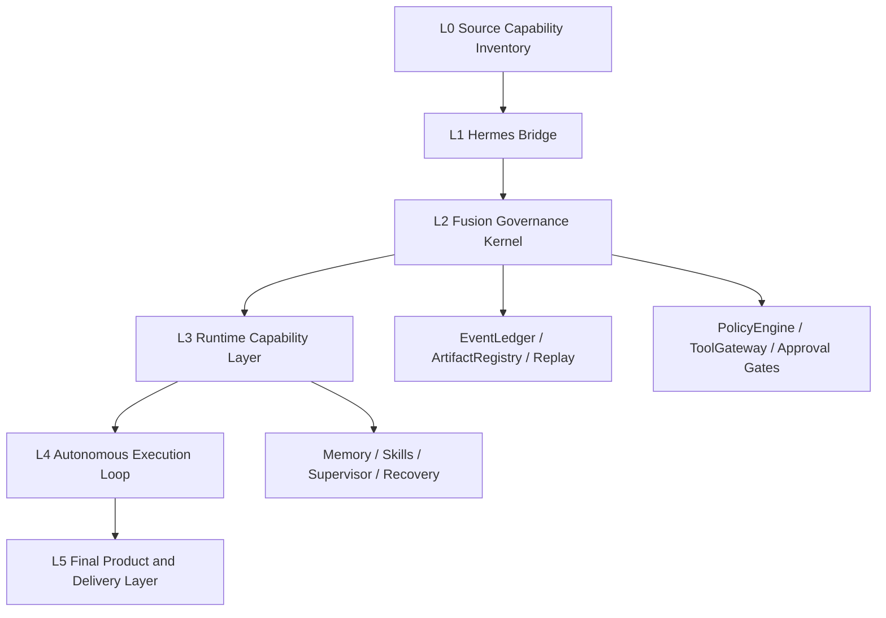

# OpenClaw-Hermes 最终融合完整设计方案

Status: FINAL_FUSION_DESIGN_READY

## 1. 最终目标

一次性形成可以交付的最终融合系统：完整保留 OpenClaw 的能力，完整吸收 Hermes 的能力，并在统一治理、连续自治、证据化恢复、多会话监督、能力晋升与最终验收方面超过两者原始能力。

这份方案不是 V1.2/V1.3 版本计划，也不是把当前基线立即封装。它定义的是一次性最终交付所必须关闭的有限验收门。

### 非目标

- 不把工作拆成无边界的 V1.2/V1.3/V1.4 版本梯子。
- 不把当前 V1.1 hardening 基线直接封装成最终版本。
- 不把 Hermes 迁移插件、适配层或叙述性矩阵当作全部融合完成证明。
- 不绕过危险写入、外部副作用、密钥访问、发布、最终封签等人工审批边界。

## 2. 前期工作证据复核

| 领域 | 已有证据 | 审计解读 |
|---|---|---|
| V1.1 hardening baseline | PR #1 已合并到 main，合并提交 a45e30b1167b04633c73a3c1191ee01f4b495fb7。 PR #2 post-merge audit 已合并到 main，合并提交 4b37872e900749bd86f35381270fef8531ee8f44。 reports/v1_1/phase_23/post_merge_integration_result.json 记录合并、测试、manifest、tag 不变性与根 policies 阴影缺失。 | 强基础，可继续承载最终融合工程；但它证明的是 V1.1 hardening 质量，不是最终融合完成。 |
| OpenClaw governance and evidence kernel | openclaw/governance/policy_engine.py 定义安全读写、修复、危险写入、外部副作用、密钥访问等风险边界。 openclaw/execution/tool_gateway.py 将安全写入、分类与 EventLedger 事件绑定。 openclaw/evidence/event_ledger.py 提供事件哈希链校验；artifact_registry.py 提供产物哈希登记与校验；replay_engine.py 支持从 ledger 重放状态。 | 这是最终融合最重要的底座；下一步要从 phase-centric 升级到 capability/workstream-centric。 |
| Hermes compatibility and migration surfaces | extensions/migrate-hermes/provider.ts、model.ts、apply.ts 支持 Hermes 配置、模型、认证、密钥、记忆、技能与文件迁移。 reports/v1_1/phase_02/hermes_behavior_matrix_result.json 记录 6 个 Hermes 行为维度为 enhanced 或 equivalent-or-safer。 | 已有真实迁移桥梁和高层行为矩阵；但 6 个维度不足以证明 Hermes 全部能力已成为 OpenClaw 原生运行时能力。 |
| Supervisor and beyond-both seed | extensions/codex-supervisor/src/supervisor.ts 具备列出会话、读取 transcript、启动/转向/中断会话、健康探测与快照能力。 | 它是超越两者能力的候选核心；仍需接入 PolicyEngine、EventLedger、ReplayEngine 与最终验收门。 |
| Current final fusion alignment branch | docs/plans/2026-07-11-openclaw-hermes-final-fusion-program.md 明确最终融合目标与非版本梯子边界。 reports/final_fusion/final_fusion_gap_audit.json 将 7 个 workstream 分为 strong_foundation、partial 与 open_gap。 tests/final_fusion/test_final_fusion_gap_audit.py 守住 adapter-only 不得冒充 runtime fusion 的约束。 | 方向已校正；现在需要完整设计、三次审计与后续可执行验收门。 |

## 3. 三次审计

### AUDIT-1 前期完成度与证据质量审计

审计问题：前期工作是否真实、可复核、可作为最终融合工程的基础？

核心发现：

- V1.1 hardening 与 post-merge audit 已通过 PR 合并、测试与报告留痕，证据链强于普通手工说明。
- EventLedger、ArtifactRegistry、ReplayEngine、PolicyEngine、ToolGateway 形成了可验证治理底座。
- D 盘移交文件中的 FINAL_SUCCESS/RELEASE_ACCEPTED 适用于当时交付口径，不能自动外推为 OpenClaw-Hermes 最终融合完成。
- Hermes 行为矩阵只有 6 个高层维度，不能替代源码锚定的 Hermes 全能力清单。
- 当前状态机、replay 与 registry 元数据仍偏 phase/release 语义，最终融合需要 capability/workstream 语义。

主要风险：

- 若把 V1.1 的发布质量证明误读为最终融合证明，会提前封装不完整产品。
- 若只保留迁移插件，Hermes 能力会停留在导入层，无法成为统一运行时的一部分。

结论：`ACCEPT_AS_FOUNDATION_NOT_FINAL_FUSION`

### AUDIT-2 最终目标对齐与融合缺口审计

审计问题：当前工程距离“OpenClaw + Hermes 全功能 + 超越两者”还缺什么？

核心发现：

- 必须建立 OpenClaw 与 Hermes 双源能力清单，每条能力都要有 source_anchor、owner_module、runtime_surface、test_surface、acceptance_gate。
- Hermes 能力需要被分类为 imported、promoted、superseded、rejected 或 blocked；只有 promoted/superseded 并有证据的能力才能算完成融合。
- 迁移插件应成为 Hermes Bridge，而不是最终运行时边界；导入后的模型、记忆、技能、认证、密钥与文件规则要进入统一生命周期。
- memory_lifecycle.py 与 skill_lifecycle.py 已有规则雏形，但缺少 Hermes-origin 数据的运行时强制、回滚、审计与验收证据。
- Supervisor 具备多会话控制潜力，但还没有被纳入统一 policy、event、replay、repair、acceptance 闭环。
- 最终交付还缺 fresh install、upgrade、smoke、核心 e2e、包完整性与第三方无私有上下文复现证明。

主要风险：

- 能力清单不完整会让“全部功能”变成不可证明的口号。
- 只做适配与迁移会得到两个系统的拼接，而不是融合后的新系统。
- 继续按版本号推进会掩盖真正的完成条件。

结论：`TARGET_NOT_YET_MET_BUT_ROUTE_IS_DEFINED`

### AUDIT-3 完整设计可行性、风险与验收门审计

审计问题：完整方案能否收敛成一次性最终交付，并且避免不安全自治和过度声明？

核心发现：

- 设计可行，前提是最终状态不由版本号决定，而由有限的 capability gates 决定。
- 所有危险写入、外部副作用、密钥访问、发布、PR 合并、最终封签仍保持审批门；自治只在已批准、可回放、可修复范围内推进。
- 最终验收必须从 EventLedger/ArtifactRegistry/ReplayEngine/测试结果派生，不能手写最终状态。
- 最终方案应引入 GateMachine 或扩展 StateMachine，让 capability/workstream 成为一等验收对象。
- 必须把 beyond-both 能力写成可执行场景：证据驱动自治、多会话监督、能力晋升/替代、可回放自修复、统一记忆技能 provenance。

主要风险：

- 过早发布 final 会固化缺口。
- 自治边界不清会造成不可接受的外部副作用。
- 缺少 Hermes 源码锚点会让验收无法被第三方复核。

结论：`DESIGN_FEASIBLE_WITH_STRICT_GATES`

## 4. 最终融合架构

最终系统采用 capability-centric fusion architecture：能力是最小验收单位，证据是唯一最终事实来源。

### 架构层

| 层 | 名称 | 职责 | 输出 |
|---|---|---|---|
| L0 | Source Capability Inventory | 扫描并登记 OpenClaw 与 Hermes 的所有能力、源码锚点、运行入口、配置入口、测试入口与文档依据。 | CapabilityRecord, SourceAnchor, CoverageGap |
| L1 | Hermes Bridge | 承接 migrate-hermes 的导入能力，但把导入结果交给晋升决策，而不是停留在适配层。 | ImportPlan, MigrationEvidence, PromotionCandidate |
| L2 | Fusion Governance Kernel | 统一 PolicyEngine、ToolGateway、EventLedger、ArtifactRegistry、ReplayEngine、StateMachine/GateMachine 与审批边界。 | GateEvent, PolicyDecision, ReplayableState, FinalAcceptanceInput |
| L3 | Runtime Capability Layer | 把模型、工具、记忆、技能、认证、项目状态、恢复协议、supervisor 与扩展运行时纳入同一能力生命周期。 | PromotedCapability, SupersessionProof, RuntimeParityTest |
| L4 | Autonomous Execution Loop | 在审批边界内执行 plan -> act -> evidence -> validate -> repair -> accept 的闭环。 | AutonomyRun, RepairDecision, BoundedRetry, HumanApprovalRequest |
| L5 | Final Product and Delivery Layer | 完成安装、升级、包完整性、端到端场景、操作手册、移交包与最终封签。 | InstallProof, E2EProof, ReleaseCandidate, FinalFusionSeal |

### 建议模块

| 路径 | 目的 |
|---|---|
| `openclaw/fusion/capability_inventory.py` | 生成双源能力清单，记录 CapabilityRecord，并输出缺口报告。 |
| `openclaw/fusion/capability_gate.py` | 定义 capability/workstream 验收门，替代单纯 phase-centric 完成判断。 |
| `openclaw/fusion/hermes_promotion.py` | 把 Hermes Bridge 的导入结果晋升为 OpenClaw 原生运行时能力，或记录 superseded/rejected 决策。 |
| `openclaw/fusion/supersession.py` | 证明某项 Hermes 能力被更强 OpenClaw/fused 能力替代，并绑定测试与证据。 |
| `openclaw/fusion/final_acceptance.py` | 只从 capability gates、ledger、registry、replay 和测试结果派生最终封签状态。 |
| `extensions/migrate-hermes/*` | 保留为 Hermes Bridge，但输出结构化 promotion candidates。 |
| `extensions/codex-supervisor/*` | 升级为受治理的多会话执行与恢复入口。 |

### 数据契约

| 契约 | 字段 |
|---|---|
| CapabilityRecord | id, source_system, source_anchor, runtime_surface, owner_module, status, risk_class, parity_tests, fusion_tests, evidence_paths, acceptance_gate |
| PromotionDecision | capability_id, decision, reason, target_runtime_surface, required_tests, rollback_plan, approval_required |
| FusionGate | gate_id, scope, required_evidence, required_tests, policy_boundary, replay_check, status |

## 5. 有限工作流

| ID | 工作流 | 交付物 | 完成条件 |
|---|---|---|---|
| WS1 | 双源能力普查与对照表 | OpenClaw capability inventory Hermes capability inventory capability parity matrix unmapped/unknown gap list | 每条能力都有源码锚点、运行入口、测试入口、owner 与验收门；unknown_count 为 0。 |
| WS2 | Hermes Bridge 到原生运行时晋升 | promotion decision log Hermes-origin model/auth/secret/memory/skill/file lifecycle tests adapter-only gap closure report | 每项 Hermes 能力均为 promoted、superseded 或 rejected-with-evidence；没有 adapter-only 完成声明。 |
| WS3 | Capability-centric governance kernel | CapabilityGate/GateMachine ledger event types for promotion and supersession registry metadata for capability/workstream scope replay support for final fusion state | 最终状态可从 ledger/registry/replay 派生；phase 只作为历史证据，不再作为最终融合唯一模型。 |
| WS4 | 记忆、技能与知识生命周期融合 | Hermes-origin memory validation skill promotion and rollback metadata expiry/audit/purpose enforcement knowledge provenance report | 导入、使用、晋升、回滚、过期与审计都有运行时证据和测试。 |
| WS5 | 受治理的自治执行与恢复 | bounded autonomous execution scenarios interrupt/resume/retry tests repair decision evidence approval boundary tests | 系统可自动推进安全范围内任务；跨审批门时停止并生成明确审批请求。 |
| WS6 | Supervisor 融合与多会话治理 | policy-mediated supervisor commands session transcript evidence ingestion multi-session replay and recovery tests supervisor health and steering gates | 多会话监督成为统一治理闭环的一部分，而不是独立外设。 |
| WS7 | 可安装、可运行、可移交的产品化 | fresh install proof upgrade proof package manifest and hash registry operator handoff third-party reproducibility smoke | 第三方无需私有上下文即可安装、运行、验证核心融合能力。 |
| WS8 | 超越两者的融合能力 | evidence-driven autonomous project execution capability promotion/supersession engine replayable self-repair loop governed multi-session supervisor final acceptance derived from capability gates | 每项 beyond-both 声明都有可执行测试或可回放证据。 |

## 6. 最终验收门

- 已知 OpenClaw 与 Hermes 源码表面的能力清单覆盖率为 100%。
- 每一项 Hermes 能力都被晋升、被更强能力替代、带证据拒绝，或被明确风险门阻塞。
- OpenClaw 原生治理、证据、迁移、supervisor、记忆、技能与恢复测试保持通过。
- 融合专项测试覆盖导入、晋升、策略、重放、恢复、supervisor 与最终验收。
- fresh install、upgrade、smoke 与 package verification 可在没有私有对话上下文的环境中复现。
- 最终状态不得手写声明，必须从 ledger、registry、replay 与测试证据派生。
- 发布、tag、PR 合并、破坏性动作、外部副作用与密钥访问保持人工审批门。

## 7. 实施路径

这些阶段是有限 gate，不是继续延展的版本号。

| 阶段 | 名称 | 目的 | 退出条件 |
|---|---|---|---|
| A | Source-anchored capability inventory | 先把全部能力变成可证明对象，结束“全部功能”不可验收的问题。 | inventory.json、parity_matrix.md、unknown_count=0 或 documented_blockers。 |
| B | Promotion and supersession decisions | 决定每项 Hermes 能力如何进入最终系统：晋升、替代、拒绝或阻塞。 | 所有 Hermes CapabilityRecord 都有 PromotionDecision 和测试计划。 |
| C | Fusion kernel implementation | 实现 capability gates、promotion events、supersession proofs 与 replayable final fusion state。 | governance/evidence/replay 测试证明最终状态可派生。 |
| D | Runtime integration | 把模型、工具、记忆、技能、认证、secret、supervisor、恢复协议纳入统一运行时。 | 核心融合 e2e 场景通过，adapter-only gap 为 0。 |
| E | Product acceptance | 完成安装、升级、包、操作、移交与第三方复现。 | fresh install、upgrade、package、handoff、smoke 全部有证据。 |
| F | Final fusion candidate | 只在所有 gates 关闭后生成候选封签，不创建新的版本梯子。 | FinalFusionSeal 为 derived-ready，等待用户批准发布动作。 |

## 8. 立即下一步

- 实现 `openclaw/fusion/capability_inventory.py` 与生成器，扫描 OpenClaw 与 Hermes 源码/文档/测试入口。
- 输出 `reports/final_fusion/capability_inventory.json` 与 `capability_parity_matrix.md`。
- 新增测试：unknown capability 不得被计为完成；adapter-only 不得被计为 promoted。
- 在完成清单前，不创建最终发布、不打 final tag、不声称最终融合已完成。

## 9. 最终判断

前期成果可以接受为强基础，但不能被命名为最终融合完成。最终交付必须等到双源能力清单、Hermes 能力晋升、统一治理内核、记忆技能生命周期、自治恢复、Supervisor 融合、产品化复现与 beyond-both 能力全部通过证据化验收门。

当前结论：`FOUNDATION_ACCEPTED_FINAL_FUSION_NOT_YET_COMPLETE`

下一步：构建源码锚定的 OpenClaw 与 Hermes 双源能力清单。
